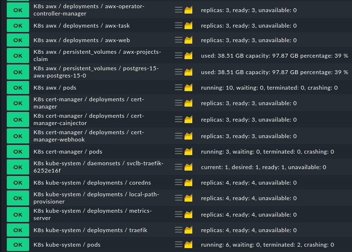
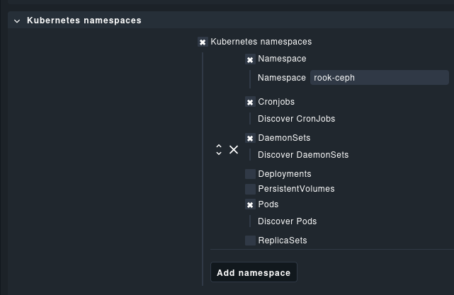
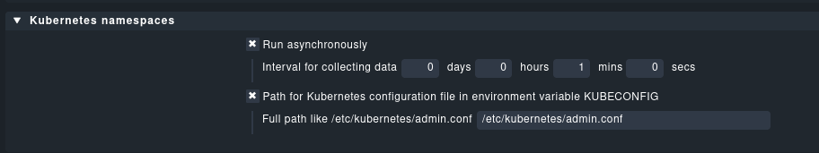

# checkmk-agent-plugin-kubernetes

## Overview

This project provides a Checkmk agent plugin for monitoring Kubernetes namespaces and their resources.
It includes server-side WATO settings for configuring some monitoring parameters.

Only Checkmk agent plugin will be installed on the Kubernetes nodes. The plugin will collect the data and deliver it to the Checkmk server.
The collected data are retrieved from local `kubectl` commands, so nothing needs to be installed on the Kubernetes cluster.

## Features

- Monitor Kubernetes namespaces and these resources:
  - CronJobs
  - DaemonSets
  - Deployments
  - PersistentVolumes
    - 🥳 special feature: monitor the capacity of persistent volumes
  - Pods
  - ReplicaSets
- Set percentage thresholds for PersistentVolume usage
- Set thresholds for CronJob counts
- No extra agent needed on the Kubernetes nodes

## Development

For local development the included `docker-compose.yml` file might help.

## Usage

Upload the `.mkp` file to your Checkmk instance.

The plugin will be available in the agent bakery.

The resulting services in Checkmk will look like this:

If just some cluster resources should be monitored, the WATO rule can be used to customize some namespaces:

Agent settings like the `kubectl` binary path can be configured in the agent bakery:

## License

This project is licensed under the GPL3 license.
